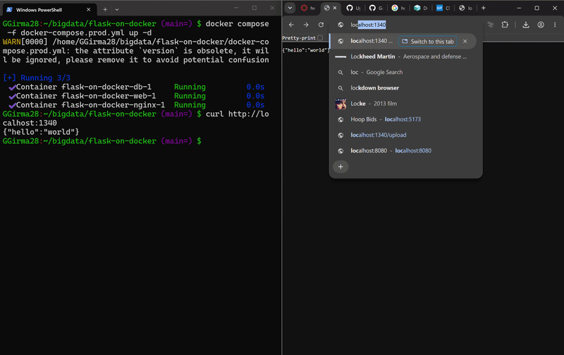

# Flask on Docker

## Overview

This project is a simple Flask web application that I made while learning how Docker and different web services work together. It uses PostgreSQL for the database, Gunicorn to run the production application, and Nginx as the web server. The application also lets a user upload an image and view the uploaded image.

## Demo

The GIF below shows the webpage running, uploading an image, and viewing the uploaded image.

## Development

Clone the repository and enter the project:

    git clone https://github.com/Gaarbra/flask-on-docker.git
    cd flask-on-docker

Start the development version:

    docker compose up -d --build

The development app runs on port `5002`.

Open:

    http://localhost:5002

Check the containers:

    docker compose ps

Stop the development version:

    docker compose down

## Production

The production database credentials are stored in `.env.prod.db`. This file is intentionally not included in the repository and should never be committed.

Create `.env.prod.db` locally with:

    POSTGRES_USER=hello_flask
    POSTGRES_PASSWORD=hello_flask
    POSTGRES_DB=hello_flask_prod

Start the production version:

    docker compose -f docker-compose.prod.yml up -d --build

Create the database:

    docker compose -f docker-compose.prod.yml exec web python manage.py create_db

The production app runs through Nginx on port `1340`.

Open:

    http://localhost:1340

Stop the production version:

    docker compose -f docker-compose.prod.yml down

## Uploading an Image

Go to:

    /upload

Choose an image and upload it.

The uploaded image can then be viewed at:

    /media/IMAGE_FILE_NAME

## Technologies Used

- Flask
- Docker
- PostgreSQL
- Gunicorn
- Nginx
- GitHub Actions
